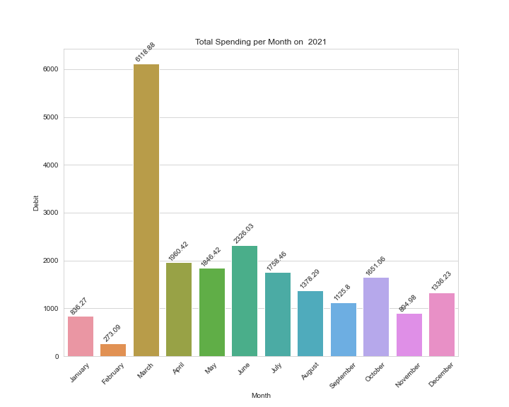

# Credit-Card-Spending-Analysis
## Transactions extracted from TD Bank Credit Card Statements:

In this project I:

- Developed a script to review, extract, and clean the personal credit card spending history using Pandas.
- Created a pivot table to summarize the maximum, average, and total spending per month per year from 2019 to 2021.
- Using the max aggregate function in conjunction to the pivot table, summarized the maximum spending per month per year from 2019 to 2021 only.
- Identified the two largest transactions per month per year from 2019 to 2021 using a simple for loop and the max pivot table.
- Designed a bar plot to map the maximum, average, and total spending per month per year from 2019 to 2021 to clearly visualize credit card spending patterns.
- Narrowed down the scope to the year 2021 and created a barplot with the total spending each month.
- Created a box plot per month for the year 2021 to analyze the spending distribution without outliers.

### Credit Card Spending Visualized:

### Credit Card Pivot Table:
  

## Conclusions from this project:
- From the Facetgrids visualization of the average, maximum, and total credit card spending, the highest spending trends occurred in June 2020, March 2021, and March 2022. It is important to observed that after the spike in spending, the month after (July, April, and April respectively) show a significant decrease in the spending trend.
- From the barplot representing the total spending per month in 2021, we can see that from the month of February to the month of March there was an increase in total spending from $273.09 to $6118.88, representing a 2141% increase.
- The median spending distribution in 2021 is in between $10 and $23, with the exception of January.
- January has the most widespread distribution, ranging from $12 to $74.
